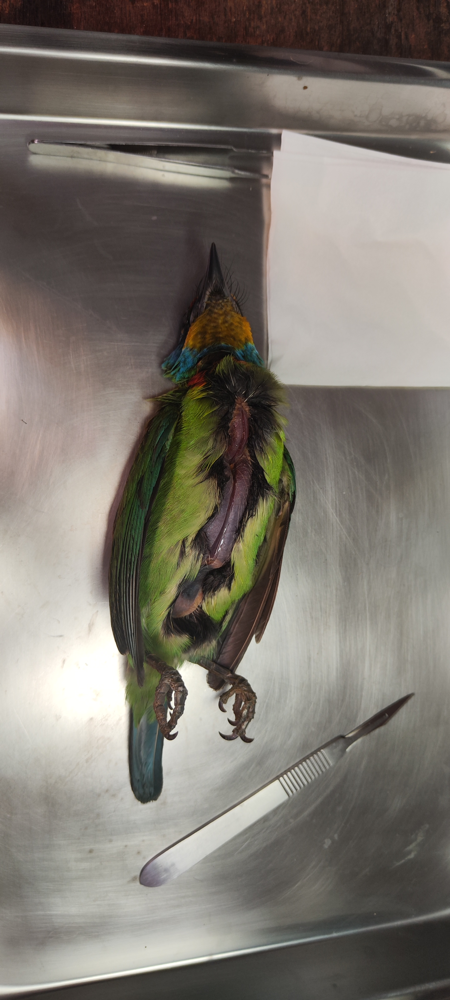
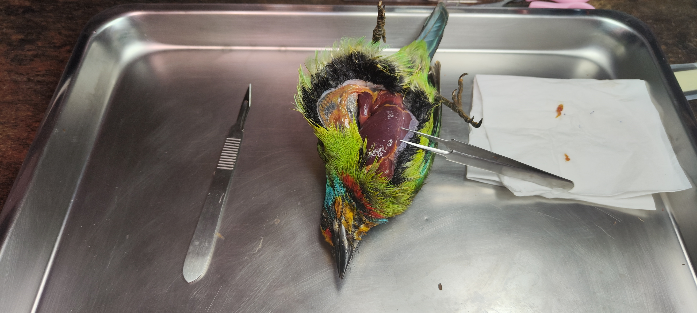
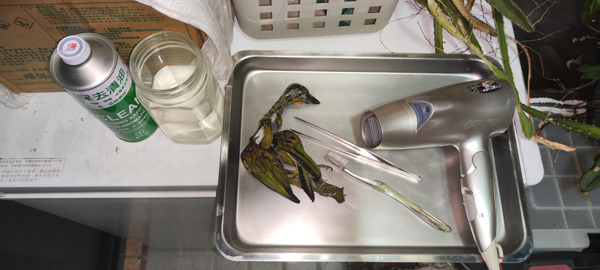

五色鳥是窗殺受害者的第一名...

他常常被人盛讚美麗，又是台灣特有的鳥種，從平地到高山都有分布。

但....

他看不見玻璃。

這一件作品呈現五色鳥撞擊玻璃的瞬間，你看見的是他仍鮮活的美麗瞬間，但你看不見的，是接下來他的嘴喙彎折、頸椎錯位、腦部震盪、胸骨擠壓、肺部瘀血.....

若是撞擊力太強導致身體側撞，還會伴隨著翅膀骨折或是腿骨骨折。

他不會立刻死亡，通常都是嚴重抽蓄一陣子才離世....

有時候休息一陣子就可以飛離，但絕大多數都是過一陣子才會因為內出血而死亡。

有沒有想過為何看不到這些鳥類的屍體呢？   留言告訴我。

-------------------------------------------------------------------------

分隔線底下含標本製作過程的血腥圖片，請慎入。

