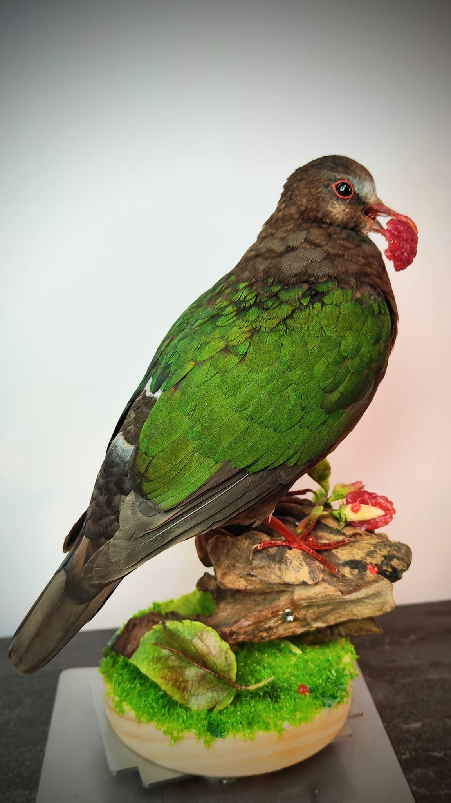

我一直懷疑翠翼鳩有一種神祕的禦敵機制-------自爆

撞窗會羽毛爆炸，被猛禽追會瘋狂炸毛，連受到驚嚇也是掉一地毛... 哪有這麼愛掉毛的....

他總是在低矮的林地底下啄食落果，吃吃走走，搖搖晃晃的超級可愛。

但或許是因為果實不會移動，不需要看得太清楚就能吃到，導致她對於建築物玻璃的感測能力也幾乎為零。

他也因此榮登窗殺前三名的苦主啊!

-------------------------------以下AI說的，但我檢查過沒什麼錯誤--------------

**翠翼鳩公母特徵差異：**

- **額頭與眉線（最主要特徵）：**
  - **公鳥：** 額頭基部及眉線為鮮明的白色，看起來頭部較亮。
  - **母鳥：** 額頭及眉線為淡灰色、灰色或帶皮黃色，不似公鳥般雪白。
- **肩部白斑：**
  - **公鳥：**

    肩角處有顯著的白色塊斑。

  - **母鳥：** 肩角白斑較小或不明顯。

- **羽色深淺：**
  - **公鳥：** 背部翠綠色鮮豔，頭部與胸部灰褐色感較純。
  - **母鳥：** 羽色整體較為黯淡、呈灰褐色，帶有斑駁感。

----------------------------------------------------------------------------

所以各位看官，您說說展場展出的這一隻翠翼鳩，是公鳥還是母鳥呢？

他們的翅膀是結構色，在陽光下會閃爍著金屬光澤喔~~

