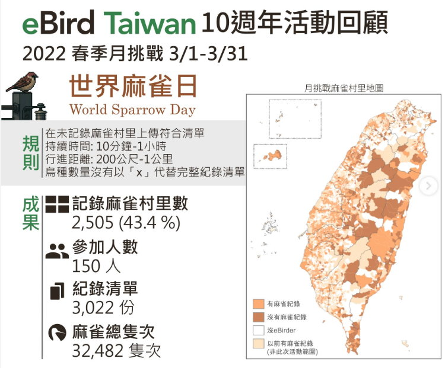

關於麻雀，你一定知道他是誰，但真的鮮少有人會去仔細的看他，可是如果靜下心來看，麻雀真的頗可愛的啊!!

我喜歡在冬日裡看麻雀，每一顆麻雀 (對，是用顆來算) 都腫脹到一種極度可愛的程度。

網路上對麻雀的描述，也算得上是一種迷因了。

麻雀雖小 五臟俱全，就衝著那個雖小的台語發音，好像他就過不得好日子似的。

台灣能看到幾種麻雀呢??  

答案是3種，一種幾乎天天見到，一種幾乎看不到，一種看到了就得要通報。   

若這一題你能根據提示回答出名字，恭喜你，你真是太鳥了~~
 

答案是

 樹麻雀 山麻雀 家麻雀
 

都市裡最常見的樹麻雀，近年也有受到外來入侵種的干擾而減少數量，但全台灣的整體數量是否有減少，仍有待深入長期的研究。
人家鳥飛來飛去嘛….   很難調查的。
 

至於山麻雀，已經是第一級瀕臨絕種保育類的鳥囉!  他們分布在海拔200-2,000公尺山區聚落與次生林交界處，因為施用農藥的關係，導致數量大幅降低，曾一度只剩下不到一千隻呢!
 

阿那個家麻雀到底是誰家的？
反正不是台灣原生種，前幾年在東港的福安宮附近發現十幾隻，有定居繁衍的情況。 鑒於他們在許多國家都是強勢入侵物種，政府可是動員不少人力把它們移除了呢。
 

好囉，這傢伙也是都市三俠其中之一喔!
