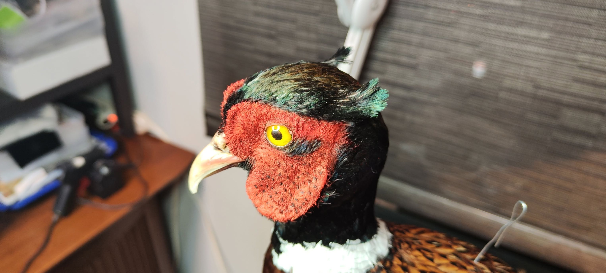
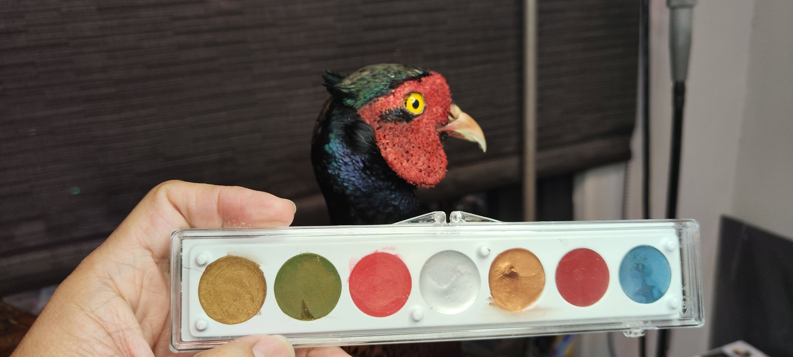

人家是韓國歐巴啦~~      等等，這句話也有很多可議之處。

飼養來當觀賞用的環頸雉，最原始的血統早已混雜。

或許外觀看起來還像高麗雉，但DNA早已混過不少種亞種。

他們在國外是game bird，被大量繁殖，定期定點野放，供做狩獵取樂之用。

好吃嗎?  還行....

羽毛倒是非常華美，體積也大，做標本氣派。

有沒有偷偷娶台灣老婆？ 根據近年的研究，沒有ㄟ~~      台灣環頸雉還是比較喜歡自己人。

鳥標專用化粧品

認真做100隻鳥標之67---環頸雉 公 *Phasianus colchicus.*

專家說這不是台灣環頸雉... 的確在翅膀和腹部的羽色不相同。

這是第二次做環頸雉，第一次是今年二月在特生中心做的台灣環頸雉。

拿到這張皮的時候，發現已經有一個大洞，而且非常非常油膩....

決定切掉尾巴，然後慢慢和肥油奮戰。

環頸雉毛多，皮也算厚，除了要劈肉垂之外，其他的部分只是按步就班的完成。

第二次做他的臉，已經比較能掌握相對位置，但還是花很多時間調毛。

這隻環頸雉分了五次完成，每次四個多小時。

看到完成的那一刻，還是很開心的~~

何以解憂？ 唯有鳥標~❤️

My second ring-necked pheasant. They are lovely birds.

Score it 85.

這是華東亞種的環頸雉，就是俗稱的高麗雉。 結果又是人生第一隻~~❤️❤️❤️
