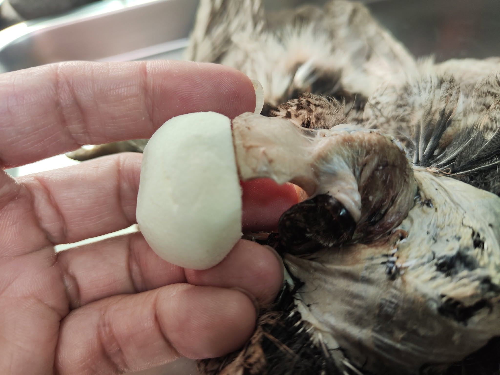
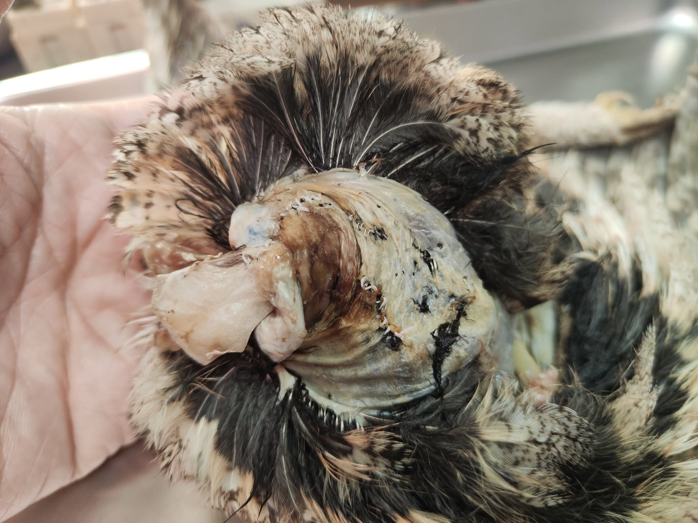
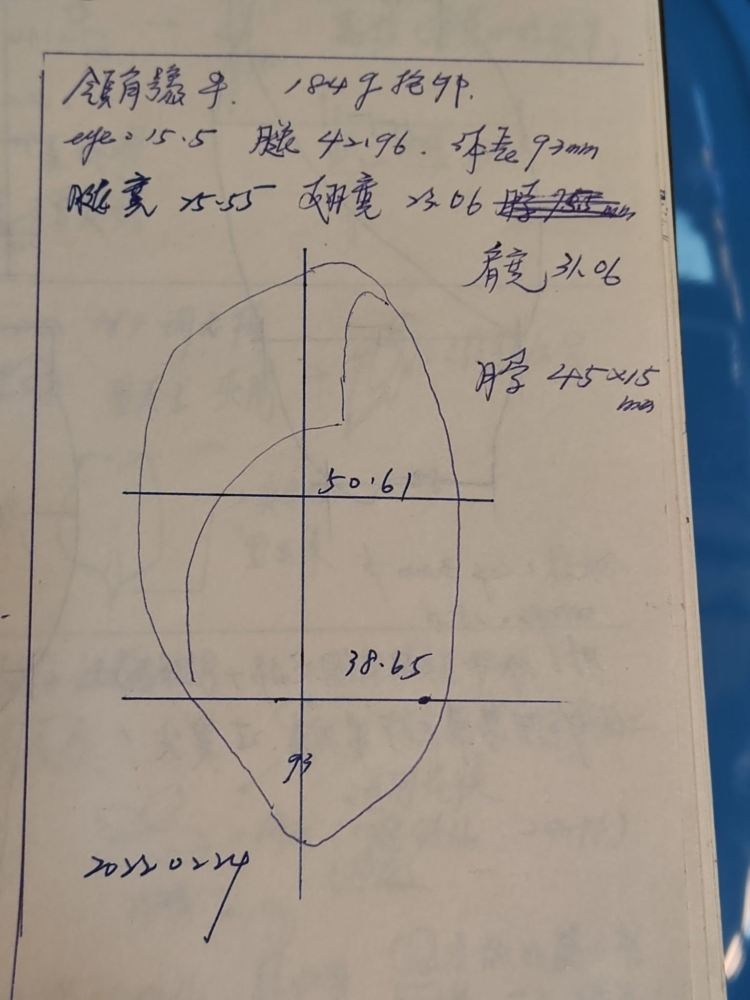

章姓偵探一拿到大體，心裡就狠狠震了一下。

是誰?  怎麼狠心的對孕婦痛下殺手?!   雙手手臂硬生生折斷，只剩下淌血撕裂的肌腱懸在那裏撐著

大腿骨骼斷成好幾節，右眼球也撞到脫出了眼眶....

偵探身兼法醫，驗屍的時候取出腹中孩兒....   這個即將臨盆的小生命，也隨著母親一起奔赴黃泉了

為什麼? 為什麼?!! 為什麼!!!!    世道就要這麼不公平嗎？ 

她可能已經生了幾個孩子，而她的老公整看著空蕩的巢穴 百思不得其解啊!  老婆平常一下子就回來了啊.....

今天只是出去覓食比較久，晚回來了一點，老婆就棄巢不顧了嗎？

這一窩，終究還是被遺棄了....    領角鴞的老公或許一輩子也不能理解，他的老婆是被車撞死的，那個泯滅人性的司機，就這樣輾過她的身體，連下車關心一下都沒有 就揚長而去了。

領角鴞會陸續產卵，幼鳥孵化時間也會有些差異。所以抱卵的母鳥，有可能同時已經在哺育幼鳥了。

讓孕婦帶孩子還要覓食，當然是很吃重的工作啊!   領角鴞在這個時候也會變成機會主義者的。

看到路邊的蟑螂、被車撞死的小動物，他都有機會跳下去吃。

如果這時候一輛打著大燈的車飛馳而過，他的本能只會往前跳飛，不會後退....

就硬生生飛到車輛前被撞。

認真做100隻鳥標之86--- 領角鴞 母。 *Otus lettia* female.

Car accident, broken skull, huge laceration on head and body. Perfect feather condition.... = Hard work.

Score it 86.

沒有領角鴞的假眼了，那種凸半球型 澄清的如水晶的棕褐色假眼..

已經進入不可逆的高假眼品質要求階段了嗎？ 其實只有針對貓頭鷹啦，其他鳥類還是可以接受不太完美的假眼。

領子貓貓真的好可愛，但無論我怎麼做，也只能形似，做不出他的靈魂啊！

一定是假眼的問題！ 好啦，還有破皮導致的毛皮位移，假體有一點點太大，下巴毛可以再拉高一些，頭顱復原的不夠完美，後頸的毛可以再收合一些....（怎麼那麼多問題...）

無論如何，嘗試了顱骨重建，也算是盡力救回了這隻貓貓。

給他86分。
