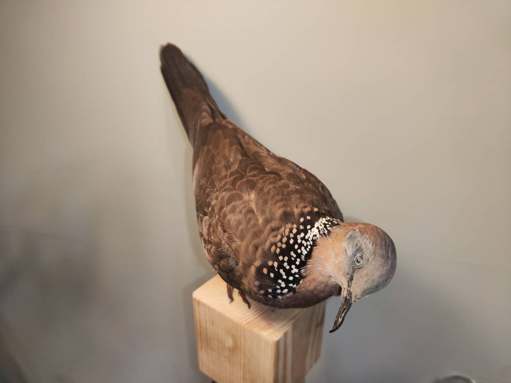

鳩鴿科的鳥統稱粉鳥。

粉鳥之所以為粉鳥真的是因為他身上有很多粉-------(這什麼廢話)

阿珠頸斑鳩為什麼要叫斑甲?

阿就真的是因為身上有很多斑嘛，口耳相傳就這麼叫了。

你不相信？    但事實就是這樣啊~  

鳩鴿科的鳥兒都有些共同的特徵，從標本師的觀點來看----一路殺就全身脫毛、窗殺鳩科幾乎都下巴掉毛速囊破裂、他們幾乎都皮薄如紙、基本上都是肥肥的。

前陣子春天，是他們的繁殖期，到處都是咕嚕嚕嚕   咕嚕嚕嚕的叫聲，家裡陽台也被強佔去生蛋了。

沒有!   陽台那一家子我沒動他，母斑鳩後來自己棄巢不要孵蛋了 (其實一直也沒看到公斑鳩，後來檢查感覺也是空包彈)

這隻珠頸斑鳩的大體是路殺撿拾的....   沒有做好....   大哭....  車禍撞爛了一邊的肩羽，怎麼拉都拉不回來....

雖然他是很常見的鳥類，但鳩鴿科ㄟ!  鳩鴿科啊!   鳩鴿科就是難做的意思啊!!!   

冰箱裡是還有一隻啦，但就很不想動手了。  

做成這樣，我無顏面對江東父老....

但你知道嗎？能進入100隻系列的鳥都很不容易的~~      沒進去的數量遠多於能進100隻的啊!

做得不好，已經是我的日常了.....

一定會再調整心態，重新做一隻美麗的珠頸斑鳩!!
