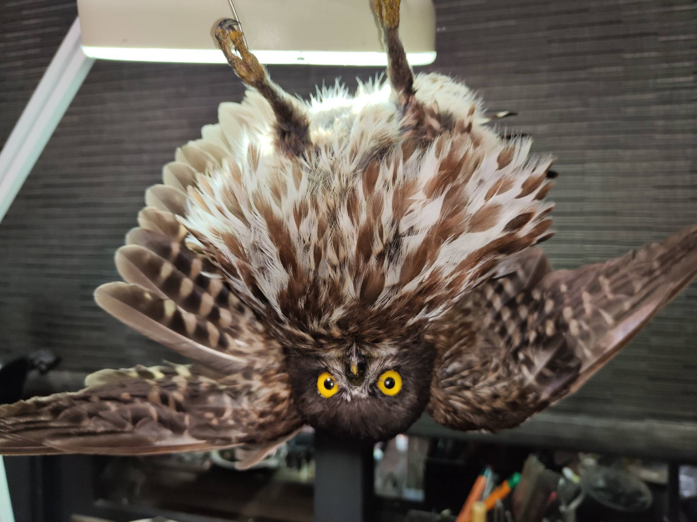

如果貓頭鷹真的會送信，那等待著這一封信的人，只能失望了

這隻褐鷹鴞看起來好聰明~~  應該是個能投遞包裹的好貓頭鷹。 

但是他撞車死了。

或許是夜色掩映了樹的倒影，讓轉角那台車隱了身，讓遠道遷徙而來的褐鷹鴞，怎麼也穿不過車道。

他們每一年都過境台灣....   每一年都留下幾個同伴，再也回不去原生地。

來一張製作過程中的搞笑照片，緩和一下沉重的心情吧。

努力再做好100隻鳥標之11---褐鷹鴞，公，*Ninox scutulata，*Brown Hawk Owl，Male.

他的表情管理真是很困難...

翻一百張照片有九十九張都是臭臉怪樣，毛又雜亂不堪（跟遊隼天壤之別）... 到底放鬆眼神柔和是有多難...

國外買的這批假眼有些瑕疵，瞳孔不完美，內部的凹面也不夠深，導致眼睛就還是差一點，

這隻是車禍死的，死在一個永遠是春天的地方。或許這是生命留給他的最後一點浪漫。

斷在腕掌骨，身上多處瘀傷，尾羽被扯掉1/3，曝曬很久，半乾屍腹部都有味道了。

很油很油很油... 遷徙性的猛禽到底是要吃多胖才肯離開台灣...

2025年死了好多個體（或許每一年都很多只是沒有被通報）

盡力了，羽毛的缺損我也沒有材料修補...

希望褐鷹鴞未來的家能保持他整齊的樣子

給他...91分

[#你知道我要說免責聲明](https://www.facebook.com/hashtag/%E4%BD%A0%E7%9F%A5%E9%81%93%E6%88%91%E8%A6%81%E8%AA%AA%E5%85%8D%E8%B2%AC%E8%81%B2%E6%98%8E?__cft__[0]=AZY0hYHJIVfoMy_70T9qaJiSWBHih8EVB_ZVYn0KfqNE7BxwjYZUKlLB43ZFpuTLZH474ueHqpC2bRWWHtKWRaIBvAtUg0c6JN0bV2k-Jk4oZ0KqsS6GQb_DOSW3TZqUiZYlNGyr-Zjtl4lprDN7sIY0stP-y47Pfi0CRvW0a9NvRAHxAWiMllvyflPrlNbwY-Q&__tn__=*NK-R)

[#致親愛的刁民](https://www.facebook.com/hashtag/%E8%87%B4%E8%A6%AA%E6%84%9B%E7%9A%84%E5%88%81%E6%B0%91?__cft__[0]=AZY0hYHJIVfoMy_70T9qaJiSWBHih8EVB_ZVYn0KfqNE7BxwjYZUKlLB43ZFpuTLZH474ueHqpC2bRWWHtKWRaIBvAtUg0c6JN0bV2k-Jk4oZ0KqsS6GQb_DOSW3TZqUiZYlNGyr-Zjtl4lprDN7sIY0stP-y47Pfi0CRvW0a9NvRAHxAWiMllvyflPrlNbwY-Q&__tn__=*NK-R)

[#公家機關委託代製](https://www.facebook.com/hashtag/%E5%85%AC%E5%AE%B6%E6%A9%9F%E9%97%9C%E5%A7%94%E8%A8%97%E4%BB%A3%E8%A3%BD?__cft__[0]=AZY0hYHJIVfoMy_70T9qaJiSWBHih8EVB_ZVYn0KfqNE7BxwjYZUKlLB43ZFpuTLZH474ueHqpC2bRWWHtKWRaIBvAtUg0c6JN0bV2k-Jk4oZ0KqsS6GQb_DOSW3TZqUiZYlNGyr-Zjtl4lprDN7sIY0stP-y47Pfi0CRvW0a9NvRAHxAWiMllvyflPrlNbwY-Q&__tn__=*NK-R)

[#保育類沒有在賣的啦](https://www.facebook.com/hashtag/%E4%BF%9D%E8%82%B2%E9%A1%9E%E6%B2%92%E6%9C%89%E5%9C%A8%E8%B3%A3%E7%9A%84%E5%95%A6?__cft__[0]=AZY0hYHJIVfoMy_70T9qaJiSWBHih8EVB_ZVYn0KfqNE7BxwjYZUKlLB43ZFpuTLZH474ueHqpC2bRWWHtKWRaIBvAtUg0c6JN0bV2k-Jk4oZ0KqsS6GQb_DOSW3TZqUiZYlNGyr-Zjtl4lprDN7sIY0stP-y47Pfi0CRvW0a9NvRAHxAWiMllvyflPrlNbwY-Q&__tn__=*NK-R)

[#不要再問了](https://www.facebook.com/hashtag/%E4%B8%8D%E8%A6%81%E5%86%8D%E5%95%8F%E4%BA%86?__cft__[0]=AZY0hYHJIVfoMy_70T9qaJiSWBHih8EVB_ZVYn0KfqNE7BxwjYZUKlLB43ZFpuTLZH474ueHqpC2bRWWHtKWRaIBvAtUg0c6JN0bV2k-Jk4oZ0KqsS6GQb_DOSW3TZqUiZYlNGyr-Zjtl4lprDN7sIY0stP-y47Pfi0CRvW0a9NvRAHxAWiMllvyflPrlNbwY-Q&__tn__=*NK-R)

My first Brown Hawk Owl. It is one of the migratory birds in Taiwan which sadly crushed by a car.

You can see the details and find out the damage to the feathers.

Trying my best as always, but still not with great results.

RIP poor Brown Hawk Owl.... 

Score it 91.
