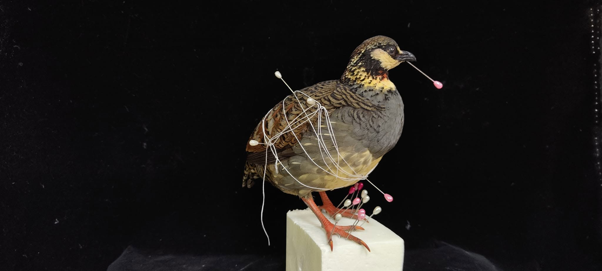

這是一篇檢討文....

關於時間會讓人看清事情真相的文章。

2023年11月，我這麼說：

認真做100隻之6 -- 深山竹雞。

解鎖人生第一隻深山竹雞~~

還行，但沒有很滿意。

胸部的毛沒有和腹部接順，原本應該過幾個小時再調（因為皮會縮 毛會倒）

但我得趕回高雄啦！

改天再來特生嫌棄他~

好可怕，過了兩年多再回頭看這隻深山竹雞....    醜哭ㄟ....

我不能再看他了....   脖子沒有折對、胸毛沒有壓順、頸部沒有撐開、裸皮後來褪色也沒有補....

你問為什麼要拿他出來展示?? 阿就沒有時間再做一隻竹雞了啊

原本要放竹雞，但後來來不及製作 (標本師很忙的，我平常還要教書跟當品管經理ㄟ)

好啦，先降，不抱怨了。

去過楓港吧? 一定有啦，不然你是怎麼到墾丁的??

楓港的特產是什麼呢？ 一度以為是鳥魷魚 (孩提時代真以為他是某種特殊魷魚)

後來發現 是烤鳥 烤魷魚。

稍微有一點點年紀的朋友，肯定知道那個鳥以前是過境的伯勞，後來因為腦部有線蟲寄生，烤鳥常無法烤熟腦子，人吃了也會被寄生，所以後來就比較少吃了。

以前窮! 是真的窮! 有什麼吃什麼!!! 屁孩不要養尊處優了去批評以前過苦日子的人。

阿現在還是有在賣烤鳥啊? 是什麼鳥呢？？ 有一度改成竹雞喔~~ 現在又不是竹雞了 (太貴太難養，野生的又很難抓)

現在烤的是香檳鳥 (正式名稱是肉用鵪鶉)

正好，原本想用竹雞，所以標題才用雞狗乖(竹雞的叫聲)；現在用了深山竹雞，他們是怎麼叫的呢？

咕嚕~~ 咕嚕~~ 咕嚕~~ 掉狗~ 掉狗~ 掉狗~~~  
  
  
ok，你又學會奇怪的知識了。
