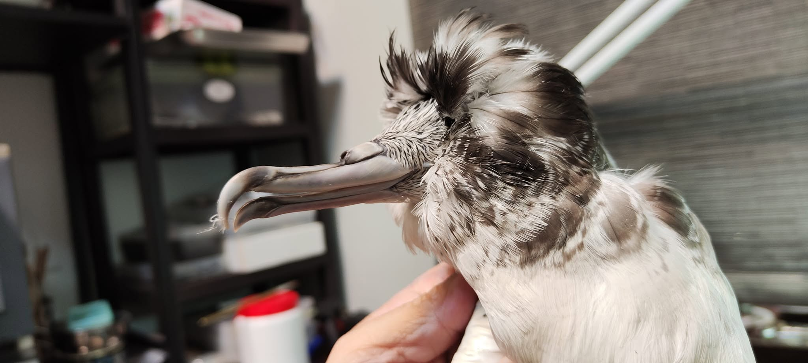
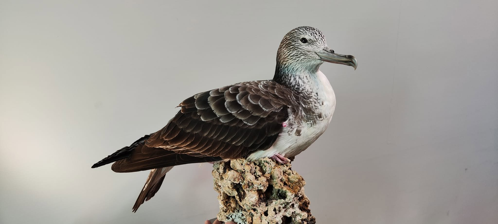

大水薙鳥是不上岸的海鳥，除了產卵，一輩子都生活在海上。  很會利用海風遷徙、很懂得波浪的一種鳥。

台灣是大水薙鳥重要的中繼站與繁殖南界。基隆外海的**棉花嶼**是目前台灣已知唯一、也是最南端的大水薙鳥穩定繁殖地。 棉花嶼上的老鼠(人為引進，漁船跳船的鼠)，對他們的後代產生了毀滅性的影響。

每年 10 月中下旬繁殖季結束後，成鳥與幼鳥會開始離開北方的巢穴南下越冬。

牠們會順著西太平洋長途飛行，前往新幾內亞北部海域、阿拉弗拉海（澳洲北部）以及南海（包含越南、菲律賓周邊）等熱帶海域度冬。

常在水邊走，難免不濕鞋。    住在熱帶太平洋的最大風險，就是夏季的颱風了吧!

這隻大水薙是颱風天被吹上岸的，腳掌受傷感染，在救傷過程死亡。

死亡的鳥類常讓我感到悲傷，但海鳥救傷過程死亡，卻算是老天爺對標本師的恩賜了。

海鳥通常都很肥  很肥  很肥    充滿魚腥味或蟑螂味.....

能處理一隻消瘦到幾乎沒有脂肪的海鳥，大幅縮減製作時間，真的很讓人感動。 不然做完一隻海鳥，人都變成魚味了....

2023年的鳥，被哪一陣颱風吹到高雄的呢?     由於當時取得的資料太少，已經無法詳細追溯了。   只能把這隻大水薙好好製成標本，讓我手邊的資料一直陪著他，等待某天發揮價值。

PS. 大水薙鳥常常被風吹到山頂ㄟ~~    合歡山曾多次發現喔~~

認真做100隻鳥標之10 -- 大水薙。*Calonectris leucomelas*

為了他，特別去水族館買了礁石。

缺了底座，又跑去買了鉆板...

鐵絲缺碼得補上，膠不夠得買新的，棉花耗盡，電火布耗盡 （山窮水盡的資源）

前前後後快十天才做好，中間還卡著重感冒...

但海鳥鮮少讓人失望的~~

毛吹乾就自然豐潤了啊~~

特別幫他墊肥一點點，救傷過程死亡的鳥兒往往瘦乾乾很可憐的樣子....

墊胖一些，希望他在另一個世界過的開心而豐腴~ 謝謝大水薙。

\*\* Calonectris leucomelas \*\*

\*\* Streaked Shearwater \*\*

My first streaked shearwater. Please point out my mistake on this taxidermy. Many thanks. 
