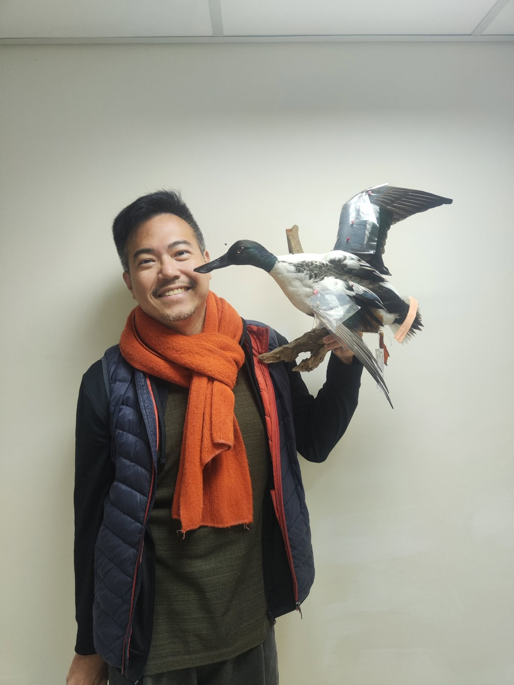
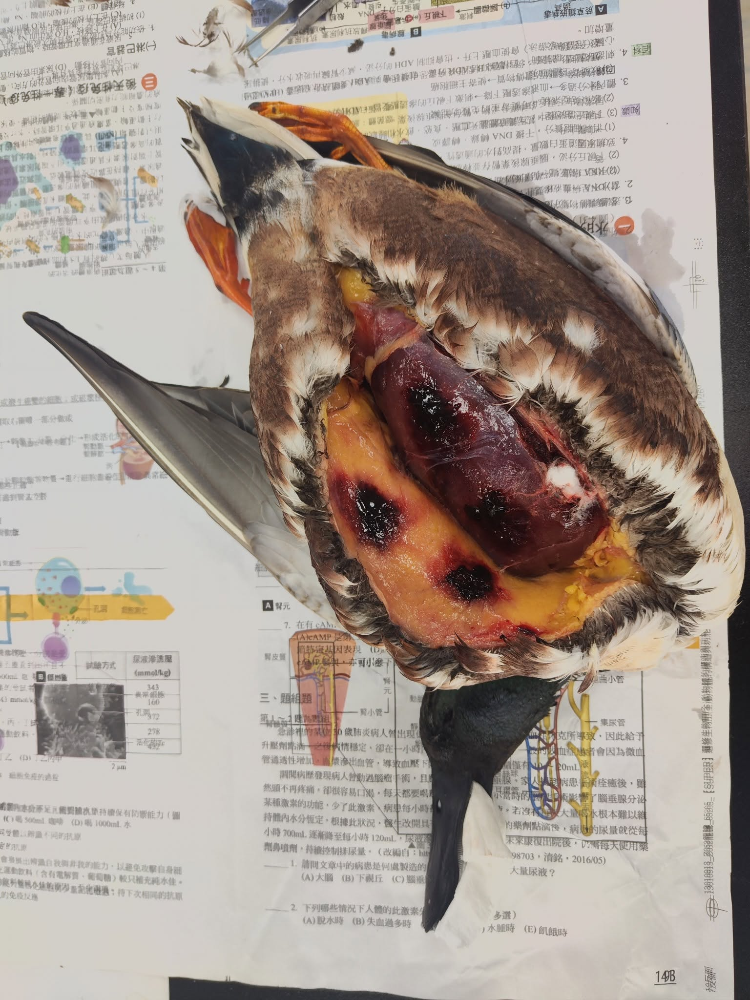
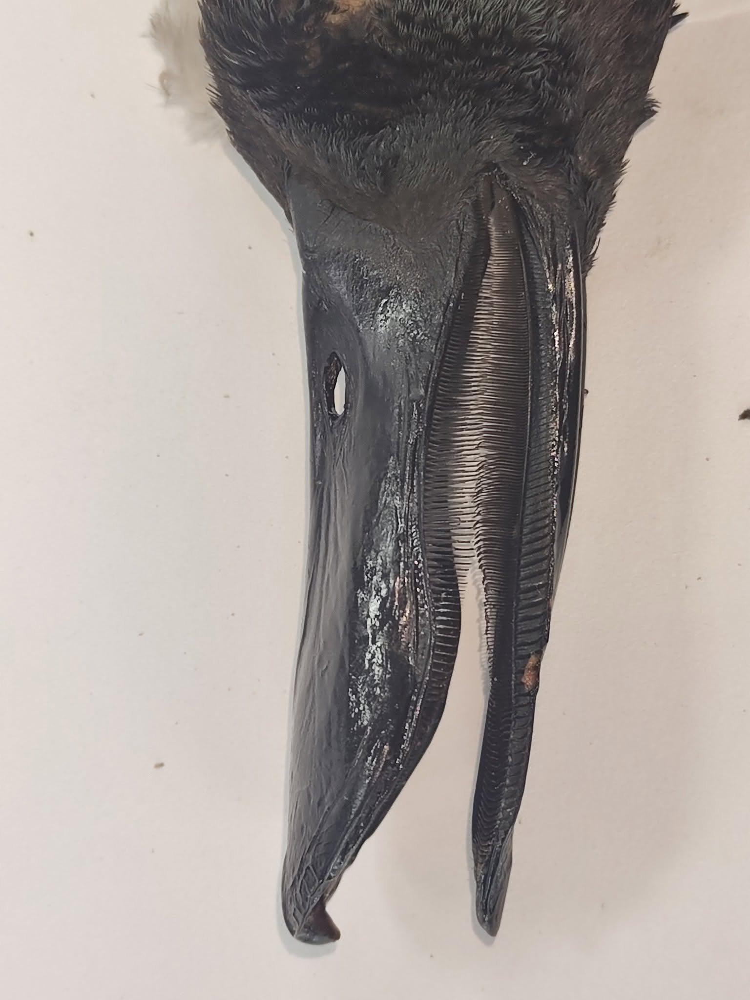

琵嘴鴨跟綠頭鴨乍看有點像。    要從嘴巴來區分。    琵嘴鴨的那個嘴真是太有特色了!!

在金門住過的鴨子，基本上一定是很肥很肥很肥的....

一直吃吃吃吃吃....    養胖了 換上美美的繁殖羽，再繼續去旅行。    

至於有多胖?   文末有血腥照片，可以斟酌觀賞。

鴨子什麼都吃，這事有很高的風險...   釀高粱剩下的酒糟，常倒在田埂做有機肥。

吃酒糟的鴨子，一不小心就會吃到真菌，而這些真菌會卡在食道和口腔的黏膜繁殖，甚至會長成厚實的塊狀，影響鴨子的呼吸和進食。

這隻算幸運? 沒有吃到這些真菌，只是被人開槍打死....(算哪門子幸運)

偷偷放一張標本師和鴨鴨的合照，他後來去生多所囉~~~

認真做100隻鳥標之95---琵嘴鴨繁殖羽，公。 *Anas clypeata*， Northern Shoveler, male.

總算，往前推進了一隻。

來自金門的琵嘴鴨，是難得的繁殖羽，在北返之前被開槍打下來。

可能是吃了太多春耕的穀子，才會被視為有害吧，確切原因不知道。

看到這麼美的羽毛，決定嘗試國外常見的飛行展翅方式，結果還算滿意。

是說鴨子都難在前半段的清皮，穿起來之後幾乎沒讓人失望過。

這一隻給他92分。

不行，初級飛羽角度不對...-4分。

