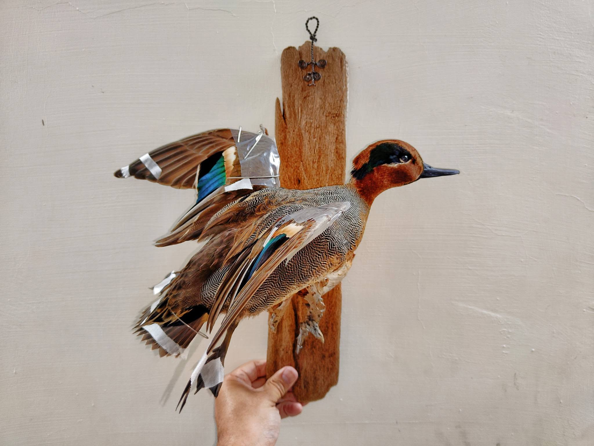

一直偷渡標本師本人的照片~~~

飛行姿態的小水鴨太可愛，忍不住跟他合照

這隻小水鴨死於農藥。  我猜是加保扶。

只有劇毒的農藥，才會讓鴨子來不及飛離開農田，就直接趴下死亡。

每年都死掉好多好多水鳥啊!     冬候鳥在春耕期間還沒離開的，基本上都是重災戶

鴨子貪吃，但對於農田是助益或是災損，真的端看何時把他們放下去....

若是秧苗長定了，鴨子進田裡吃福壽螺、吃害蟲，都能增加農田收益並且降低農藥用量，生物防治的成功案例--鴨稻共生，就是這招。

可若是剛插秧或是剛播種，鴨子進去直接嗑掉作物，那一整季的農產可就全部報銷了。

雖然政府明文規定不能使用加保扶毒鳥，有時候換位思考也覺得同情農民。 畢竟要形成日本朱鷺米或是老鷹紅豆這樣的產業規模，不是件容易的事。

飛行姿態不好做，每一根羽毛的角度都需要仔細固定。

努力再做好100隻鳥標之14---小水鴨，公，*Anas crecca*，Common Teal，male.

公的小水鴨很可愛~ 但就是皮薄油爆多。

感謝某善心人士幫忙預先清了小水鴨皮，移掉了絕大部分的脂肪，

留下堪比大峽谷的裂痕...

一早上就這麼縫縫補補的過了。

穿脖子的時候，因為拉扯到皮膚，整個脖子左邊刷一下就裂到下巴....

原本的裂痕加一加，整隻小水鴨超過半隻都破了吧...

一度要放棄飛行姿勢。

但辛苦為他量身釘了站台，又大老遠跑到台北站他，不勉力完成實在太可惜...

好吧，繼續裁切我的老靈魂，完成這一個分靈體....

小水鴨很多，每年一大群過境台灣，也有一大群就這麼魂斷台灣....

農田毒鳥的案例屢見不鮮。 人要生存我絕無意見，但鳥兒也無辜....

怎樣取得平衡呢？ 獲得87分的小水鴨不知道會怎麼說....

章小水參加過台大藝術季喔~~ 大明星來著~~

Score it: 87.
