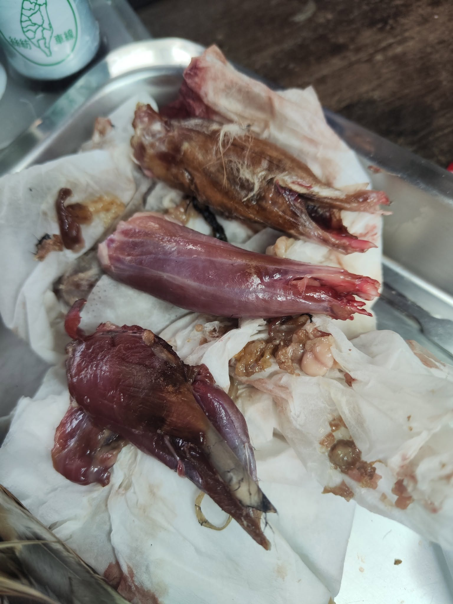

短耳鴞 母 *Asio flammeus*, Short-eared Owl, female.

這隻短耳鴞居然沒有列入100隻系列嗎???    怎麼可能...

想當初，

只是說了一句：這要還給生多所的。

差點引發家庭革命....

大家都喜歡化濃妝的眼影貓貓~~

解鎖新貓貓~~ 以下開始悲慘。

這隻是機場移除的個體，豐滿健壯毛色美麗完整。 肯定是繁殖季的優勝族群。

結果就被散彈槍從背後襲擊，四肢盡斷，大腿撕裂破皮，右翅粉碎骨折，背後皮膚千瘡百孔...

人類中心主義，都是以人命至上。 很難去說對或是錯，若不驅趕鳥兒，造成鳥擊墜機 傷及人命的時候，也不會有人站在短耳鴞這邊了吧。

還好這幾年已經有些替代方案，驅趕用的噪音、周邊架設鳥網(也還是很殘忍啦) 然而對於不顧一切一定要飛到跑道上的鳥兒，散彈槍可能還是最有效的移除方法。

為了人類的自私做些補償，只能耐心的縫，耐心的清，耐心的把假骨骼一根一根的補回去。 一整天就過了。

很油，洗好幾次，浸鞣劑，浸去漬油... 吹乾之後還不錯。

臉盤超難調，沒調過的貓貓種類，就是很難第一時間找到正確的神韻。

四個小時過去，總算看起來像眼影貓了。

翅膀羽毛也很難滑順美麗，畢竟一開始是血肉模糊的狀態....

以下血肉模糊嘿

大換毛又破皮瘀血，還好站起來之後勉強可以。

短耳鴞，母，20251107製作。 給他89分。

短耳鴞的濃妝真的好有型~ 每年遷徙七千公里，比我開兩年車還遠~~ 敬佩

Score it 89.
