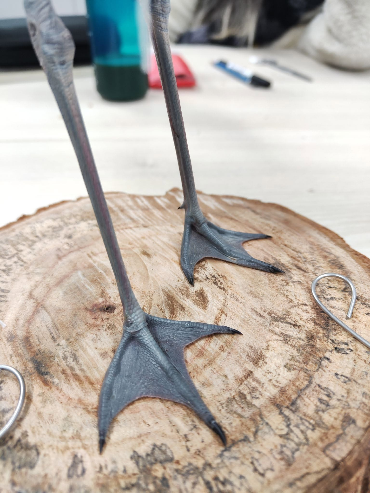

反嘴鴴死於肉毒桿菌，和人類行為到底有沒有關係??   我覺得有。

反嘴鴴會出現在農田，也常常誤食農藥而暴斃。 但這一隻是死於肉毒桿菌。

肉毒桿菌打在臉上會讓皺紋消失，那吃進去又會怎樣呢？    會神經性痲痺，四肢無力，呼吸衰竭而亡。

反嘴鴴的英文名字直譯成沙上的吹笛人。 因為他上翹的嘴喙實在特殊。

他們利用這樣的嘴，不停地翻攪沙子，把底下藏著的碎屑殘渣小魚小蝦小蟲給挖出來吃掉。

沙子底下是厭氧環境啊!   肉毒桿菌是厭氧菌。   嗯....   嗅出什麼詭異的氣氛了嗎？

沒錯，如果沙子底下是死肉，裡面就有可能會藏著肉毒桿菌，有高風險會中毒。

但生態人應該知道，肉毒桿菌通常需要大量的屍體才會出現，肉毒桿菌又會被蛆攝入而累積傳遞....

那我們想想，為什麼會出現大量的魚類屍體呢？

一定有人會說工廠排放汙水、溫室效應氣候變遷、有毒藻類大量出現.....    (都對)

通常啦，如果沙地上已經被廢水汙染，鳥又不是笨蛋，惡臭劇毒的環境他們不會愛的。

溫室效應氣候變遷，已經默默的扛下了多少黑鍋....

個人覺得最有可能造成魚類大量死亡的原因是有毒藻類大量出現(也不一定要有毒藻類)。 

藻類繁殖需要營養來源，過度施肥排放進河流的殘餘肥料，堆積在河口沙灘被藻類利用，導致藻類大量繁殖、水質變差、缺氧、魚類死亡；屍體沉在沙中，表面上看起來乾乾淨淨，但實際上埋藏了致死的細菌。

過度集約農業、農藥肥料的濫用....   水鳥成了間接又間接的受害者。    你覺得呢？

他的腳是美麗的淺藍灰色，死亡一陣子之後，顏色就褪去了。

認真做100隻鳥標之80---反嘴鴴。*Recurvirostra avosetta*. Terek Sandpiper, （botulinus）.

推測是肉毒桿菌中毒死掉的鳥兒，這一批來三隻，兩隻反嘴鴴一隻黑琵。

水鳥的生存環境真的風險很高。

因為要快速檢傷，所以大體是冷藏運送來的，還好我沒有第一線剖他，聽說很可怕。

感謝 廖子荃 剝皮 Lio Heng 畫的假體圖，讓這隻大換毛又有點不新鮮的鳥兒有機會站起來。

鴴啊！頭頂脖子都是絨毛撐出的弧度，一點掉毛就會凹凸斑駁。

這一隻真是用洪荒之力在搶救，一邊教學員，一邊縫皮調毛，一邊毛如雪片飛落....

還好平叔有練過（被迫從平平升級）

看到成品其實還蠻開心的，能把糟糕的開局做到這樣，算是有一點功力了吧。

果然那個誰誰誰說的沒錯，認真做一百隻，你就知道自己錯在哪裡了。

不知不覺也80了呢。 中間跳過的鳥兒越來越多，有的用了心但沒做好，有的做好了但太多步驟是別人完成...

100隻，是希望自己對製作的鳥兒有過深入的理解，至少自己剝過同一種鳥，自己清過同一種鳥皮，然後自己完成假體製作和調毛，最好包含定妝上色和造景（60隻之後對自己的要求），所以進度越來越緩慢了。

完成一百隻之後要做什麼呢？ 開課？ 成立工作室接案？

其實我比較想認真學習，進入第二個一百隻。

先不想這麼多，享受每一個製作的過程，慢慢體會天地大美，感受匠人才知道的微小的能力提升。

謝謝反嘴鴴，美麗的 80分。

This is my first Terek Sandpiper. Such an elegant bird that was killed by botulinus. Finally number 80. Finally, I can feel those tiny improvements in my skill. Thanks to all those people who helped me on this journey. Commission work, not for sale.
