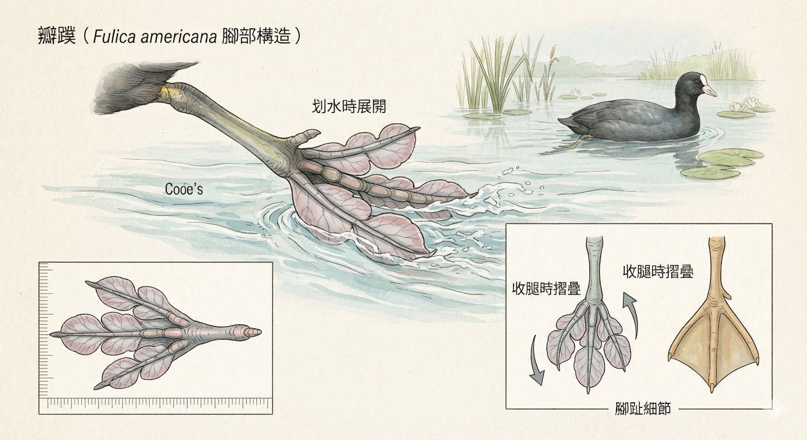
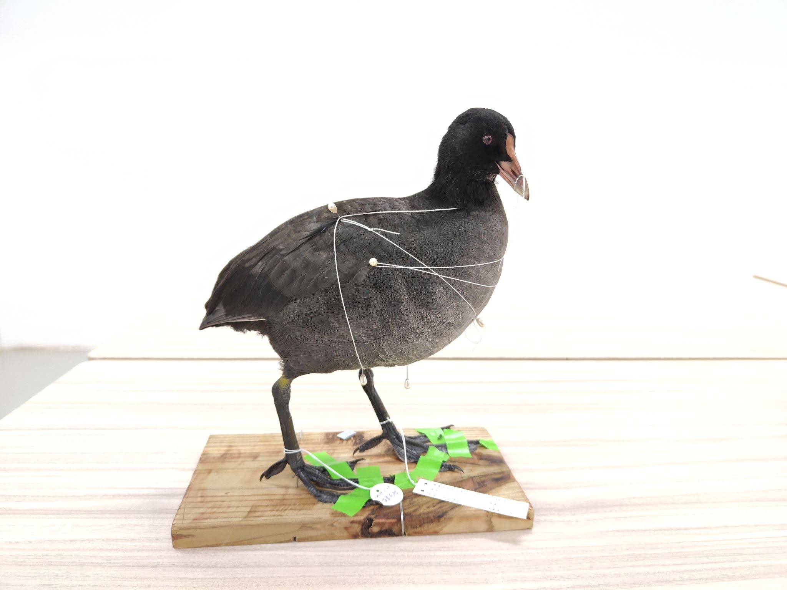

瓣蹼是水鳥在面對生活環境挑戰時，展現出的一種極為精妙的演化智慧。

白冠雞的祖先原本主要在陸地或濕地活動，當牠們試圖走向更深的湖泊或池塘去尋找更多食物時，雙腳就必須面臨在水中游泳與在陸地行走之間的兩難抉擇。

鴨子那種連成一片的「全蹼」雖然游泳效率極高，但在陸地上走起路來卻顯得搖擺笨拙，也容易被雜草絆倒。

於是，白冠雞在演化上另闢蹊徑，讓每個腳趾兩側獨立長出像半月形的皮膚瓣。

這種設計最大的優勢在於完美的「水陸兩棲」切換。

當牠們在水中向後划水時，水流的壓力會自動把這些皮膚瓣撐開，像兩把發揮強大推力的船槳，甚至能幫助牠們靈活地潛水覓食；

而當牠們把腳往前收，或是回到陸地上散步、踩在鬆軟的泥灘與浮草上時，這些瓣膜又會像自動摺疊傘一樣順應氣流與水流收攏。

這不僅將前進的阻力降到最低，更讓白冠雞在陸地上能依然保持敏捷的步伐，成功兼顧了水中的行動力與陸地的便利性。

雖然他的完美度還無法列入100隻，不過還是紀錄一下。

白冠雞 *Fulica atra*。

謝謝秀珍姊幫忙剝皮清皮，讓這隻示範教學的鳥兒變得很容易處理~

涉禽常死在水邊，對於毛皮的新鮮度是很大的威脅。 這隻的脖子掉毛一大塊，眼角也脫皮掉毛。

瓣蹼的部分尚未上色，嘴喙和白冠也都需要重新做，所以完成度大概60%而已。

不知下一次見到他是何時，也不知有沒有機會幫他完妝。(展場的工作不少，已經抽空幫他完妝)

如果下一隻有做好的話，再把它列入一百隻。
