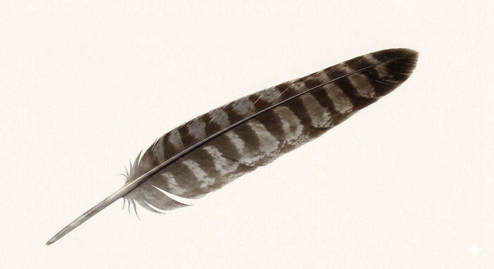

你仔細看，這隻蒼鷹是不是看起來怪怪的。    不美，和其他老鷹比起來就是差了些。

他少了初級飛羽。

初級飛羽（Primary feathers）是鳥類之所以能飛翔的原因，在飛行的過程中，初級飛羽提供了動力，也充當方向盤的功能。

初級飛羽長在翅膀的最外側，就是你吃雞翅膀最尖尖的那個部位。

那個尖尖的位置就相當於你的手指，但不要誤會了喔! 初級飛羽是皮膚鱗片演化來的，你手上的指甲和鳥爪上的指甲才是同源演化。

初級飛羽負責在飛行時提供前進的推進力（推力）與上升的浮力（升力）

當鳥兒在空中拍打雙翅，初級飛羽能隨著氣流靈活調整角度，像是飛機的螺旋槳與副翼一樣，精準控制飛行的速度、高度與轉彎方向。

此外，由於初級飛羽在飛行時需要承受極大的空氣阻力，其羽軸演化得特別堅硬且不對稱，羽片也緊密連鎖，這種強韌的結構不僅能防止羽毛在高速迎風時變形。

擁有強健而完整的初級飛羽，鳥兒才有辦法長途遷徙、高速覓食和躲避天敵。

那麼....   這隻失去了初級飛羽的蒼鷹，究竟經歷了什麼？

他在某一個島嶼被捕捉，非法飼養。

為了怕他飛走，所以抓他的人拔除了他的初級飛羽。   不是一根，是兩邊所有的初級飛羽通通拔掉。

翱翔天際的老鷹啊!!   拔除他的飛羽  禁錮著他....   多麼殘忍的一件事。

後來他被執法人員發現，送到救援單位。

正常來說，若是非與缺損，會用接羽的方式來補齊，讓老鷹仍有飛行能力，待隔年換毛完成，就可以長出新的飛羽，再次健全的飛行。

但這隻蒼鷹沒有這麼好運。     飼養了一年，當初拔除飛羽的力道太狠，傷了毛根....   再也長不出飛羽了。

救援單位無力長期飼養一隻可以生存20~30年的猛禽，食物太貴、太耗人力、野生猛禽無法馴化，永遠都想撞開籠子奔向藍天....

太多太多的不得已，只能把這隻蒼鷹安樂死了。     為此，我怨恨那個自私傷害蒼鷹的人。

人性的成長太慢，人類的繁殖速度又太快...  眾生平等的這種理想，到底要多久才能深入人心...

以為自己當了24年的老師，這個職業已經夠我心累，當標本師可以跳脫無力感。

沒想到蒼鷹還是提醒了我： 去吧，地獄裡一定要有人的，繼續宣講環境教育吧!
