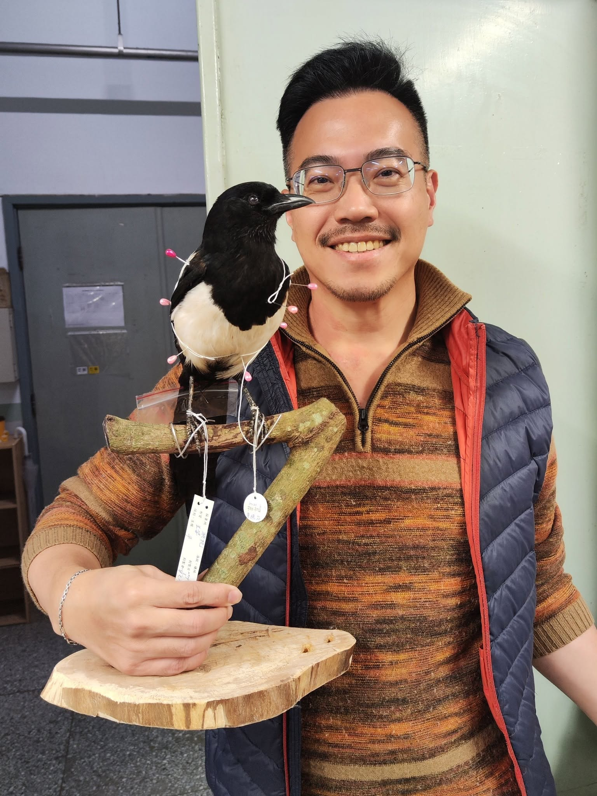

傳統觀念裡，喜鵲是代表喜慶的吉祥鳥；是愛情的見證，是牛郎與織女每年在銀河相會時所踩踏的「鵲橋」。   一個象徵了喜事降臨也見證了忠貞愛情的鳥。

但....    鴉科鳥類都碼很聰明....   和他們同科的鳥類還有烏鴉、藍鵲，都是聰明得不得了的鳥啊!

喜鵲很美。 牠們擁有黑白相間的羽毛，當光線著照在其黑色的翅膀與長尾巴上時，還會反射出極具金屬質感的藍綠色光澤。  台灣喜鵲和國外的歐亞喜鵲長得很像但細節不同，(國外的喜鵲在飛羽前端白色較多、身上羽毛的顏色多為單純的金屬綠)

(\*\*\*很愛偷渡標本師自己的照片\*\*\*)

在自然界中，喜鵲扮演「生態清道夫」與「森林建築師」角色，牠們是雜食性動物，基本上什麼都吃，危害農作物的昆蟲與害蟲、動物腐肉、小型爬蟲類 (偷偷告訴你，還有小型鳥類喔)

阿為什麼是森林建築師呢？ 因為他們會在樹上建造巨大鳥巢，繁殖期過後會成為其他中小型鳥類的育雛長所。(我還看過松鼠搬進去的)

喜鵲曾經是三級保育類動物，現在已經改為一般野生動物。   阿你知道他是「外來物種」嗎？

根據歷史文獻記載，台灣本島原本並沒有喜鵲，目前的族群多是清領時期由漢人移民或清朝官員作為「吉祥鳥」特地引進並野放的後代。

由於喜鵲適應力極強，近三百年來隨著西半部平原被高度開發與都市化，其強烈的領域性與兇猛的掠食天性，也會驅趕本土鳥類、偷食原生種鳥蛋與雛鳥，對台灣在地的本土生態造成了長期的競爭與排擠威脅。

至於到底是不是他們搞出來的大跳電，就得問問喜鵲了。

----------------接下來說說這隻喜鵲吧------------------------

認真做100隻鳥標之75，喜鵲 母。*Pica serica*， Magpie female.

喜鵲常見，卻是人生第一隻！

機場為確保飛安而移除的個體。

除了羽毛沾血，下腰部彈孔外，居然還偷偷在後腦藏了一塊大拇指大小的掉毛區...

在沒有帶適當器具的情況下，火速完成了這個標本~

過程中還示範與指導五位學員的進階標本製作~~

所有的精實都化為腰酸背痛啦！！！

可是喜鵲很可愛啊~      總覺得他和小三很像... 什麼都好，就是出現在錯的時間錯的地點....

生命無貴賤，都要認真做好。

My first magpie.
