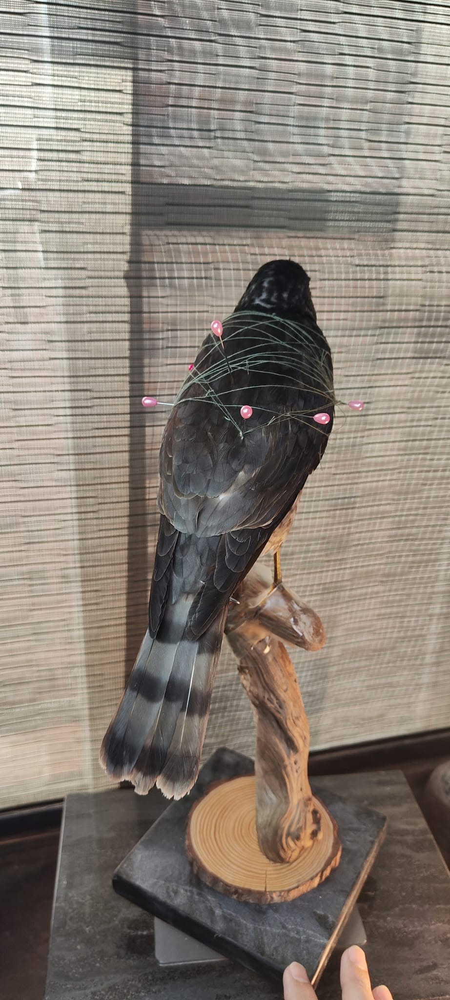
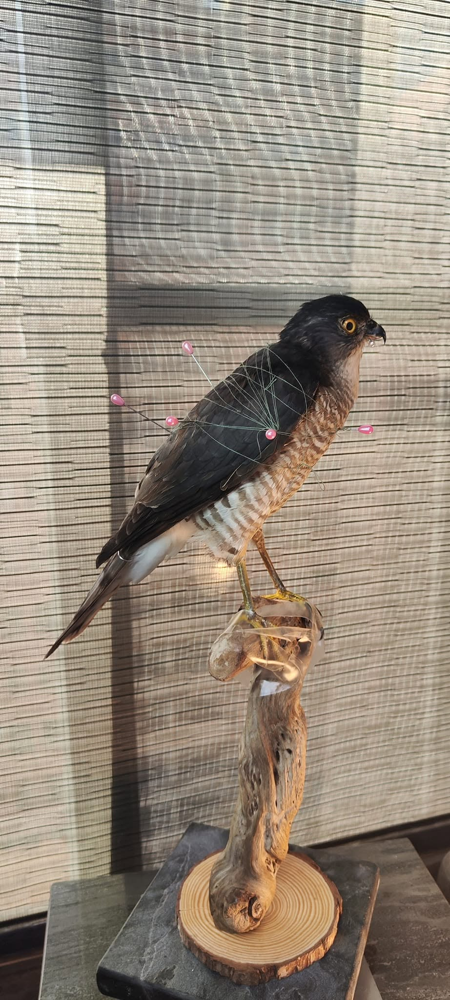
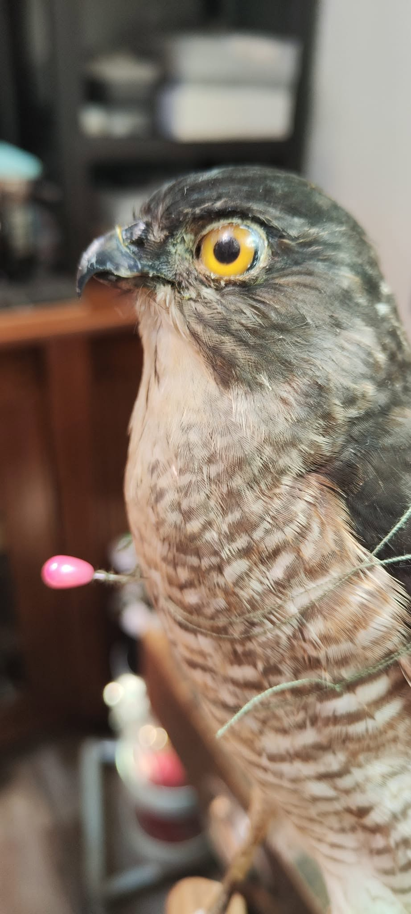
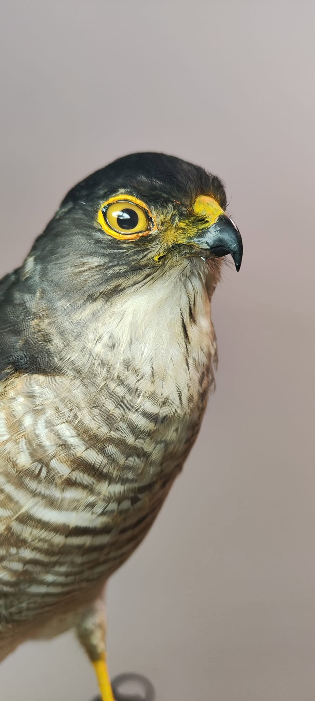
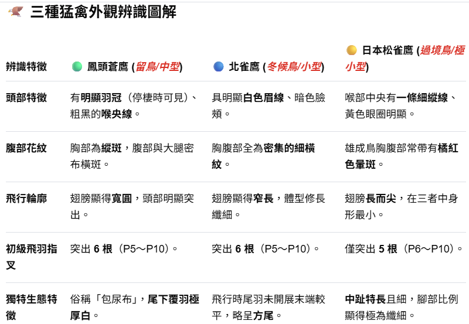

**認真做100隻鳥標之41**--- 日本松雀鷹。雌鳥。*Accipiter gularis*

認真做100隻鳥標，是比較早期的作品，那時候還沒有獨立完成老鷹的能力，總是要那個誰誰誰來指導，才有辦法看起來順眼一點。

如果看到**努力再做100隻鳥標系列**，就是進階的新一輪挑戰囉，裡面的鳥兒就美多了。( 但是遇到猛禽都還是要請教那個誰誰誰。 他真的猛禽很厲害。  還是我真的很喜歡煩他? )

(好凶，呆萌眼神的凶)

40-41中間還有一隻做失敗的。其實也沒有失敗，只是付出加倍的努力卻仍因為大體狀況不佳而未達可接受標準。

依照自己的要求，他不能列在認真做100隻鳥標系列。

第41隻是小型的猛禽，小雖小（是在繞口令？）但仍該做出猛禽的樣子。

可是真的很讓人生氣，為什麼都還要別人指出缺點，才能夠有點樣子呢....

對於技術不夠純熟這件事感到氣憤。 但還是很感謝過程中指導過我的人，松雀鷹感謝你們~~

成就一件標本真的需要結合很多因素，溫度，處理時間，大體狀況，當天的心情，研究資料是不是足夠，有沒有摸過或看過活體....

路真的還很長，還有59隻，但也沒人能保證100隻之後就能有獨當一面的能力。

好的，抱怨完畢，下一隻該輪到翠翼鳩還是戴勝，或是會有金背鳩插隊呢？ 😆

(事過境遷回頭再看當時的文字...   翠翼鳩---失敗、戴勝---拖到90多隻才做、金背鳩--變成努力再做100隻系列的第19隻)

人生啊~   真是充滿了不可預期的事。

保育類鳥類係公家機關委託代製，非私人收藏。 （差點就忘了打這段）

#農業部生物多樣性研究所

**----- \*\*\*   來看看化妝的重要性   \*\*\* -----**

化妝前

化妝後

--------------------------------------------------------------------------------------------

以下是我問GPT如何辨識三種老鷹的回答...

看完之後我直接放棄

