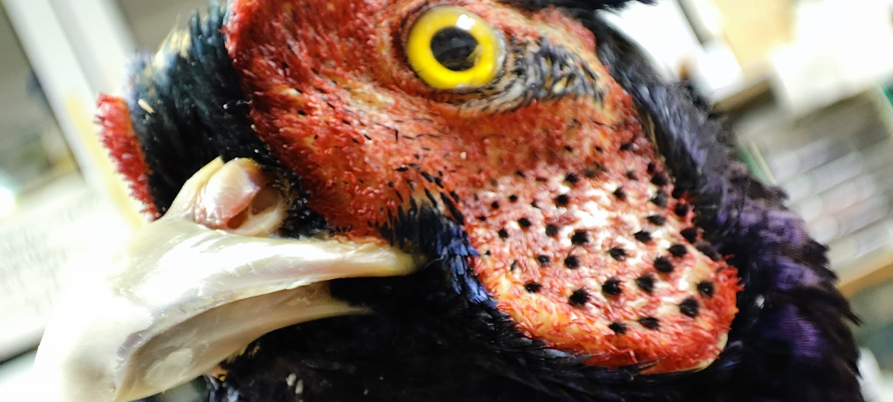
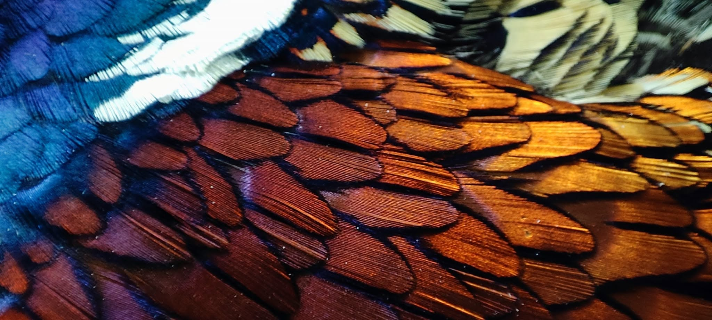
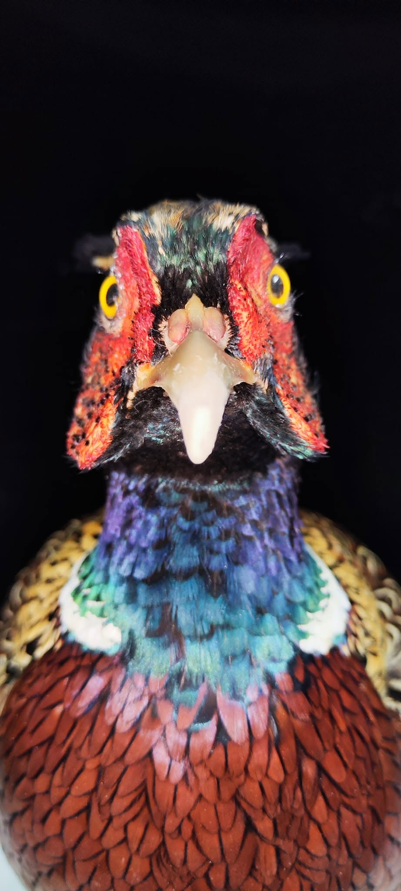
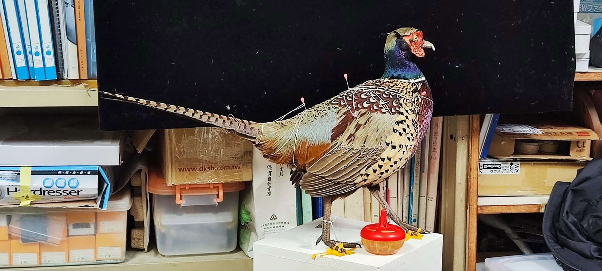
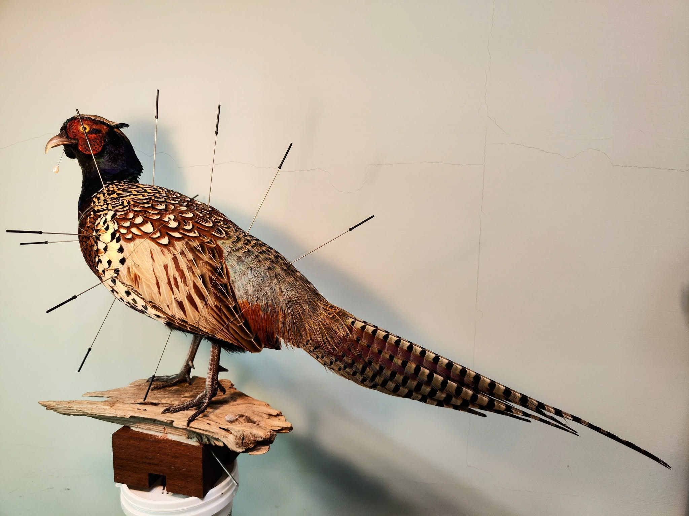
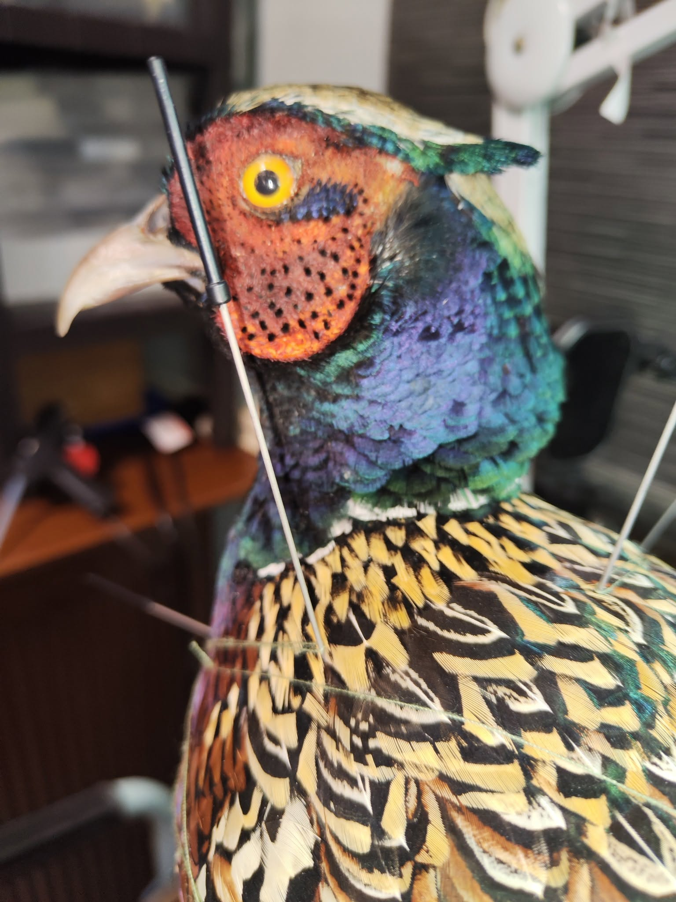
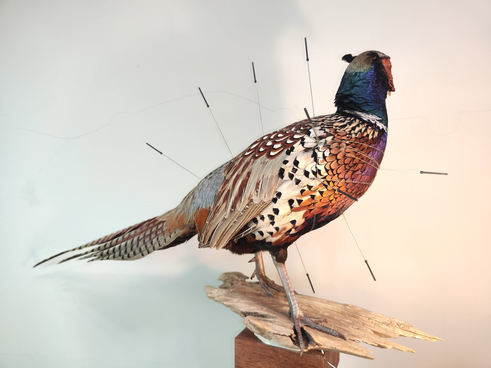
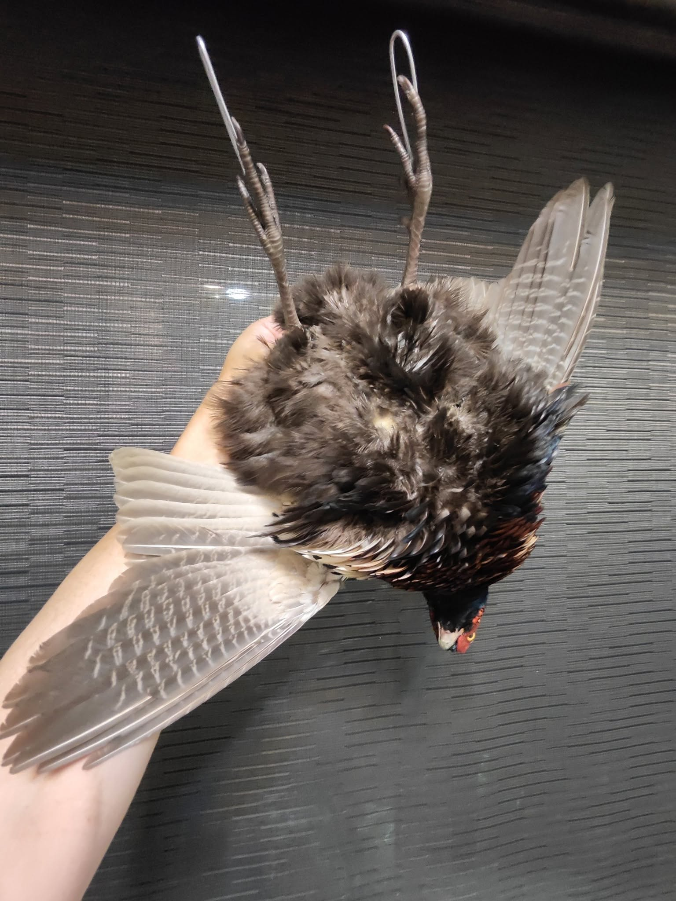

展場裡有兩隻環頸雉，一隻是台灣環頸雉，一隻是高麗雉。

長得有點像又不太像，你可以找出來比較看看喔~~~

台灣環頸雉我做過兩隻，一隻是認真做100隻鳥標系列的44隻，另一隻則是認真做100隻鳥標系列的第99隻( 後來被除名，因為有人說他不夠好。  哭哭 )

以下來看看我的心路歷程吧，也可以比比看這兩隻不同時期的台灣環頸雉，看看製作水準有沒有進步喔~~

---------------------------------------第一隻-------------------------------------------20240219

重點是我不是雉

看什麼看!?    這角度感覺好凶

環頸雉的毛好俗艷，好喜歡~~

正面，完全呈現缺點

那個脖子和體態...  到底!!!

認真做100隻鳥標之44---台灣環頸雉。公。*Phasianus colchicus formosanus Elliot*, 1870。

My first Formosa Ring-necked pheasant. I score it 88.

完美的窗殺個體，撞窗後在眼前斷氣，立刻冷凍寄送，沒有任何換羽，沒有寄生蟲，大概兩三歲，正是愛漂亮的年紀啊！

所以，壓力山大.... 因為沒有任何理由容許失敗了....

肉垂是極大挑戰，畢竟自從上次黃大仙教過一次怎麼劈白鷴肉垂，到現在已經超過半年了啊！

感謝 Cheng-te Yao 主任，提醒眼睛位置太後面 （整整往前移了快一公分，之前是有怎樣的認知錯誤 🤣）

也感謝黃0杰（他害羞就不標他了，他就是那個誰誰誰），能從他那裡學到技巧並學以致用，讓標本能漂亮個好幾十年~~ 我替環頸雉表達誠摯的感謝。

獨立做一隻環頸雉，並且必須力求完美，真的是.... 很令人滿足的事。

完成啦~ 我覺得可以給到88分。

喔，照片當然有修（寫給廣大的酸民朋友），用靈魂跟環頸雉奮鬥三天之後，照片不修能見人嗎？ 😆

--------------------------------------第二隻---------------------------------------------20250831

腳不對，壓太低，翅膀角度垂的也不對

耳孔是怎樣，生病了才會鼓出來啊

肉垂太扁了不自然

這角度 勉強還行

尾巴砍下來另外做，三不五時都要倒吊一下，當膨膨雞來玩

**認真做100隻鳥標之---**（\*\*\*等一下，這個排名有爭議，暫時不排他上去）---台灣環頸雉。

Phasianus colchicus formosanus，male, Subspecies of ring neck pheasant. CR in Taiwan.  
Taxidermy No. ---（sorry,it may not good enough to be the No.99）.

I finally understand the relationship between a bird's emotions and its changes in shape.

I finally understand that all these connections must be perfectly aligned to truly capture a bird's lifelike appearance.

But I'm still not perfect. I keep making mistakes, and sometimes I can't even clearly articulate where I've gone wrong.

There's still a long way to go, towards the next hundred.

重新製作一次台灣環頸雉。 比第一次做得好，但還是不夠完美。 (有天上的神仙說：它錯誤太多無法言喻)

不再一味追求蓬鬆肥胖，開始考慮鳥類在不同情緒條件下所表現的體態差異。

這次做的情境是環頸雉在行走過程中，突然聽到身旁動靜而轉身觀望的瞬間。

略受驚嚇時，眼神必須機警，羽毛會收攏一些，感覺比較瘦。

尾巴會下垂，臉部肉垂也不會極致漲大，呈現一點唯唯諾諾的遲疑感。

大鳥做起來還是累人啊！ 感謝 Cheng-te Yao 幫忙剝皮，也感謝 Lio Heng 轉介大體。

能有機會做到只分佈在台灣的瀕危亞種環頸雉，是幸福的。

環頸雉在國外被視為娛樂用鳥類，常大量培育後放到野外供人狩獵取樂。

這隻環頸雉死因離奇，就倒在路邊的石牆旁。

但接下來的幾十年甚至幾百年，他都會用這個面貌與世人相見了。 當然後續還會美妝一下，做個眼瞼 幫肉垂上色等等。

標本師承載著很多不對人言的感受，每一個認真製作的作品，都蘊藏著自己的一片靈魂。

終於也不那麼覺得對不起他們了？？ 結果好像還是很對不起他😭

Score it: sigh....

\*\*總結缺點如下\*\*  
1. 腿的位置不對  
2. 假體長度太長--尾巴插的不夠進去，還有救，  
3. 脖子角度，要更塞進下頜，脖子出假體的延伸不夠。  
4. 耳孔後太膨...  
對不起，只能除名了。😢
