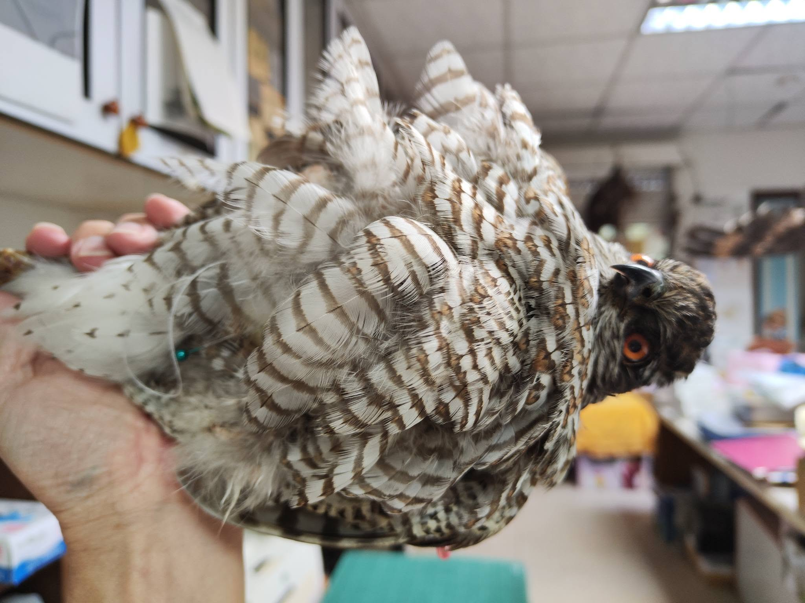
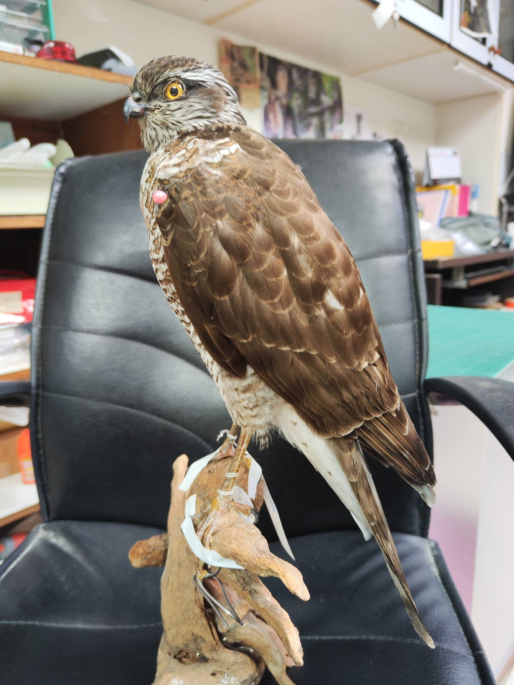
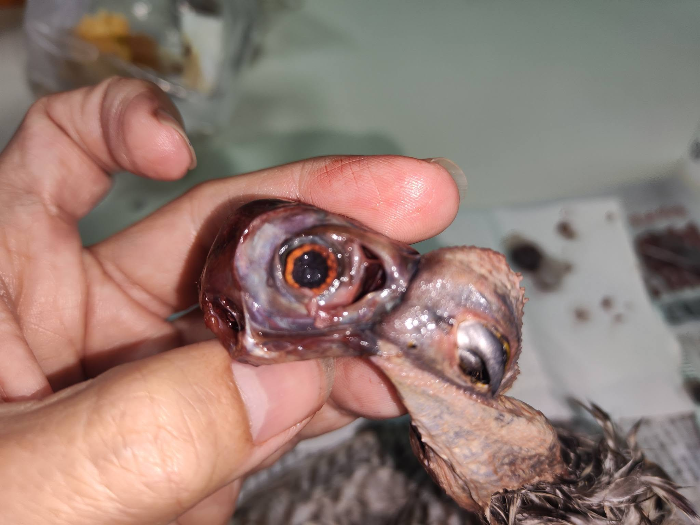

我想直接轉貼臉書的文章就好了，這隻北雀鷹...   稀有，給了我很多的磨難...

**努力再做好100隻鳥標之7**---北雀鷹，公。 *Accipiter nisus*， Eurasian Sparrowhawk， male.

稀有冬候鳥啊~~❤️ 在潭子區撞窗死掉的鳥兒。標籤上面寫著 No.275

羽毛很整齊漂亮，和我摸過的老鷹最大的不同點，是他的羽毛幾乎完全防水ㄟ~~

噴水上去會凝成水珠滑掉的程度，很像 Gore-tex的防潑水層。

腹部絨毛很密，層層疊疊的蓋住無羽區，整體乾乾淨淨，看起來就是很美好的樣子 （的樣子...）

只有一點點悶悶的味道，一點點... 一開始還以為那就是北雀鷹的氣味...

猛禽輕鬆剝，皮韌不會有事，而且他超瘦的，都沒有什麼脂肪~~

加上前一隻是做葦鵐，這隻大他超過20倍，簡直閉著眼睛神速操作~~❤️

一直到斷尾椎的時候都沒有察覺什麼異狀。 一刀下去，糞水四溢...

趕快塞棉花用紙巾擦拭，噴水清毛吸乾（正常操作，嚇不到我的）

奇怪，塞了三大坨棉花了，還是被浸濕流湯....

後面就換棉花 再塞 繼續清潔和剝皮。

整個頭殼都是血，腋下頸部都有皮下瘀血，看來撞的不輕，但沒吐血。

剝的過程保持的還算乾淨，掙扎在要清洗和不清洗之間，但腹部因為沾到糞水，還是沖洗一下好了，浸過去漬油會更蓬鬆，想到就開心。

距離下班時間還有一個小時，洗完吹完，隔天穿鐵絲假體，行程一整個順暢~ 那就洗吧。

整隻浸水洗根本就是個錯誤!！

羽毛浸濕之後，表皮就開始水解了欸！！！

一整個出現戴勝危機！！！寧靜無人的實驗室彷彿突然響起巨大的警報聲，好像四面都亮起的閃爍著的黃色警戒燈！！！

（不知道什麼是戴勝危機的，去看我的臉書，之前**認真做一百隻鳥標系列**裡面的第96隻，有詳細說明。）

嚇得我連忙沖掉清潔劑，真的連滾帶爬的去把他用毛巾吸乾 用吹風機吹乾，很少這麼緊張的把皮也吹乾的....

猛禽只有水洗會很難吹蓬絨毛，但還要浸去漬油跟他賭一把嗎？

稀有過境鳥，幾乎撿不到大體的北雀鷹ㄟ，如果表皮繼續水解 變成只能做棒式，我可能會被喜愛猛禽的朋友杖斃吧....

還是浸一下好了，或許溶掉一些什麼未知成分，可以暫停水解（此時我的小腦袋已經閃過幾千種可能性，可怕的高速運轉）

浸完吹乾，沒有掉毛，簡直要跪在地上謝神了（還好週末辦公室沒人，不然會看到一個人誇張的表演著喜怒哀樂的默劇...）

放進夾鏈袋冷藏之後，熊熊發現已經晚上快八點了，強烈的飢餓感襲來，對欸，我沒有吃中餐呢...

時光就這麼在辦公室裡形成了一個小小的結界，倍速的方式汲取靈魂做為交換（常常，我覺得標本師逝去的不止是青春，當老師教書也是這樣的...）

安慰人心的260元鹹酥雞，刈菜雞火鍋，半杯格蘭菲迪18年威士忌後，用昏迷的方式結束了上半場。

隔天一早灌了兩杯咖啡，準備全心面對下半場的挑戰。

很小心的局部讓皮回潮，一點一點的慢慢縫，從內部定位皮膚，不敢從外側拉毛。

正常來說，頂多三十分鐘就拉到定位 縫完猛禽了吧，這次從八點半搞到三點，才縫上最後一針，然後進入驚險的調姿勢和調毛階段。

感謝過程中給予指導的那個誰誰誰，還有意見很多的他們，以及直接過來盯場的那一位。

總之，北雀鷹做到了還行的狀態，剩下最後的美妝了，等月底的鳥標班再過去補妝。

好久沒有90分以上的作品，是標準高了還是能力退了....😔

Score it 85.

喔對了，為了防止那些pH值很低的網友作亂，還是要寫一下 #免責聲明。  
說到都懶得再說了還是要為親愛的刁民再說一遍...

#公家機關委託待製  
#保育類物種不得私自持有  
#非賣品！！！        ***(你看看，標本師得承受多少誤會...)***

***底下有血腥的***

******
